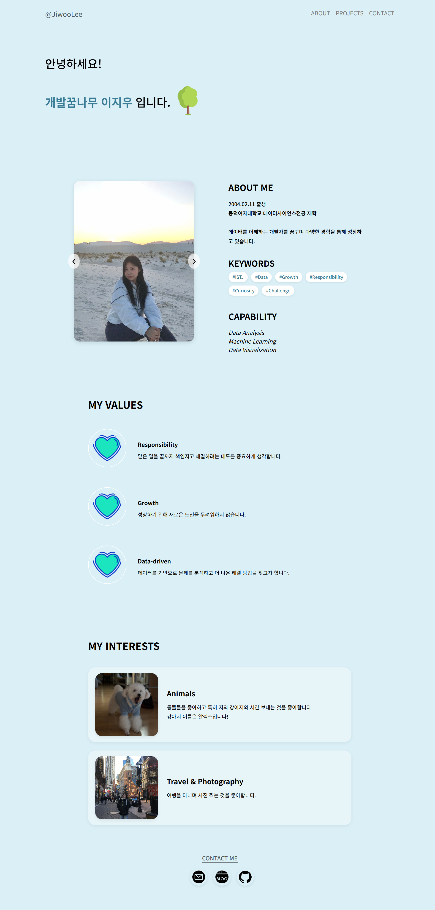

# 🌿 Jiwoo's Portfolio (Introduce Webpage)

**"데이터를 이해하는 개발자를 꿈꾸며 성장하고 있는 이지우입니다."**
 
HTML, CSS, JavaScript를 활용하여 제작한 자기소개 웹사이트입니다.

## 🔗 Live Demo
> **웹사이트 바로가기:** [jiwoolee211.github.io/introduce-webpage](https://jiwoolee211.github.io/introduce-webpage/)

---

## 📸 Preview

*웹사이트의 전체 구성 화면입니다.*

---

## Key Features
* **Interactive Intro:** 메인 접속 시 "안녕하세요! 개발꿈나무 이지우입니다." 문구가 나타나는 타이핑 애니메이션을 구현했습니다.
* **Profile Slider:** `prev`, `next` 버튼을 통해 여러 장의 프로필 사진을 확인할 수 있는 이미지 슬라이더 기능이 포함되어 있습니다.
* **Information Sections:**
    * **ABOUT ME:** 전공 및 교육 배경과 개인적인 키워드(#ISTJ, #Data 등) 소개
    * **MY VALUES:** 책임감, 성장, 데이터 기반 사고 등 중요하게 생각하는 가치관 기술
    * **MY INTERESTS:** 개인적인 관심사 공유
* **Smooth Navigation:** 상단 메뉴 클릭 시 각 섹션으로 부드럽게 이동하는 스크롤 효과를 적용했습니다.

---

## Tech Stack
* **Language:** HTML, CSS, JavaScript
* **Design:** Flexbox Layout, Google Fonts
* **Deployment:** GitHub Pages

---

## Project Structure
* `index.html`: 웹사이트의 전체적인 구조와 콘텐츠
* `style.css`: 레이아웃 설계 및 상세 디자인
* `js.js`: 타이핑 효과 및 슬라이더 동작 제어 로직
* `projects.html`: 향후 진행할 데이터 분석 및 웹 프로젝트 정리 공간

---

## Contact
* **Email:** [dorosi211@gmail.com](mailto:dorosi211@gmail.com)
* **Blog:** [Naver Blog](https://blog.naver.com/jivvooo)
* **GitHub:** [github.com/JiwooLee211](https://github.com/jiwoolee211)